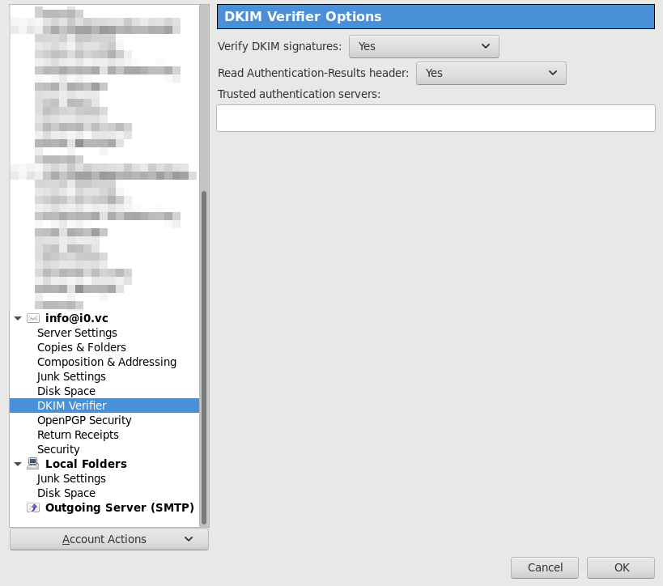
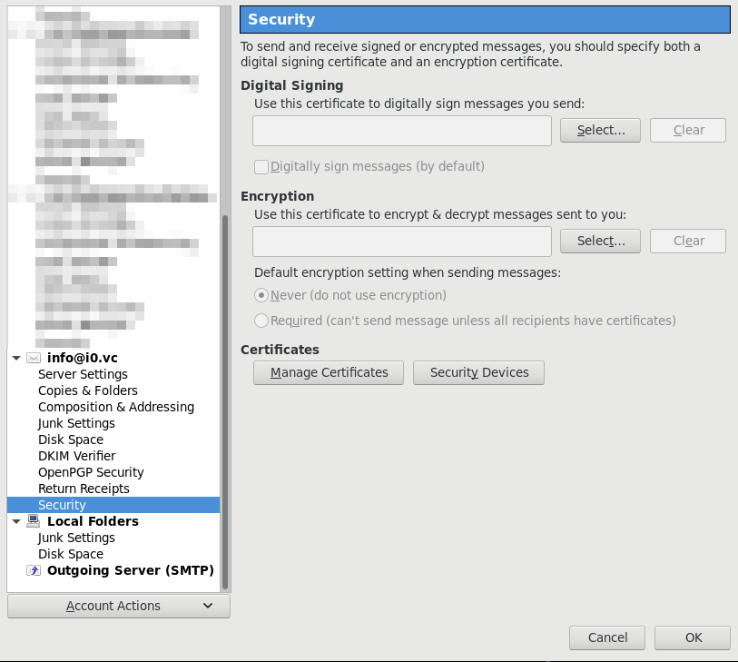

# CENTOS 7 DESKTOP SCRIPTS

## BASE INSTALL

### NETWORK & HOSTNAME

Connect (for install).

### DATE & TIME

Set time zone and enable optionally enable NTP.

### INSTALLATION SOURCE

`On the network: http://mirror.centos.org/centos/7/os/x86_64/`

### SOFTWARE SELECTION

`Minimal Install`

### INSTALLATION DESTINATION

Automatic works ... even for only 2 GiB HDD.

May want to do separate `/home` and  `/tmp` to mount them `noexec`.

Recommended to setup encryption.

## CONFIGURATION

After hitting INSTALL you can configure user settings.

### USER SETTINGS

Don't set a `ROOT PASSWORD`.

Add a user via `USER CREATION` and make that user administrator (uses `sudo`).

## SETUP

After installation you need to setup the installation by running some of the
`.sh` scripts:

* `01_install_closed_firewall.sh`: for install where you don't want SSH (physical machine)
* `01_install_i3.sh`: my basic i3wm desktop install (has some dependencies)
* `02_install_vboxguest.sh`: for installing the Virtualbox guest additions (virtual installation)
* `03_install_apps.sh`: install main set of applications that I use (only from main CentOS repos)
* `04_install_apps.sh`: install main set of applications that I use (including from EPEL)
* `05_install_apps.sh`: install main set of applications that I use (including from nux-dextop and external sources)
* `06_update_openvpn.sh`: set SElinux stuff when you update OpenVPN config
* `07_{install,update}_virtualbox.sh`: install  VirtualBox and update/rebuild DKMS (needed after kernel updates)
* `08_{install,update}_kernel-ml.sh`: install and update mainline kernel from the elrepo.org repository


## Calibrate touch screen

Requires: `05_install_apps.sh` (for `xinput_calibrator`)

Run:

```bash
xinput_calibrator
```

Follow the instructions. Then copy the calibration to `/etc/X11/xorg.conf.d/99-calibration.conf`.


## Set default applications in terminal

```bash
exo-preferred-applications
```

## Firefox

* `about:config`
	* `keyword.enabled` = `false`
	* `browser.fixup.alternate.enabled` = `false`
	* `browser.search.widget.inNavBar` = `true`
	* `browser.search.suggest.enabled` = `false`
	* `browser.urlbar.autoFill` = `false`
	* `browser.urlbar.autoFill.typed` = `false`
	* `browser.urlbar.suggest.bookmark` = `true`
	* `browser.urlbar.suggest.history` = `false`
	* `browser.urlbar.suggest.openpage` = `false`
	* `browser.urlbar.formatting.enabled` = `false`
	* `browser.safebrowsing.downloads.enabled` = `false`
	* `browser.safebrowsing.malware.enabled` = `false`
	* `browser.safebrowsing.phishing.enabled` = `false`
	* `datareporting.healthreport.uploadEnabled` = `false`
	* `extensions.screenshots.upload-disabled` = `true`
	* `network.IDN_show_punycode` = `true`
	* TODO 
	
* Add-ons:
	* uBlock Origin
	* NoScript
	* HTTPS Everywhere
	* Cookie Quick Manager [optional]
	* Stutter [optional, may be insecure]

## Thunderbird

### Add-ons

	* Enigmail
	* DKIMVerify

###  POP settings








## LUKS

### Format

```bash
sudo cryptsetup luksFormat /dev/sdb1
sudo cryptsetup luksOpen /dev/sdb1 new
sudo mkfs.ext4 /dev/mapper/new [-L <disk label>]
sudo e2label /dev/mapper/new <new disk label>
sudo cryptsetup luksClose new
```

### Add key

```bash
sudo cryptsetup luksAddKey /dev/sdb1
```

### Mount cloned drive (that has UUID of already mounted drive)

```bash
sudo cryptsetup luksOpen /dev/sdb1 old
sudo mount -o nouuid /dev/mapper/old ~/mnt
# do stuff
sudo umount ~/mnt
sudo cryptsetup luksClose old
```

### `e2fsck`

```bash
sudo cryptsetup luksOpen /dev/sdb1 dev2fsck
sudo e2fsck -f /dev/mapper/dev2fsck
sudo cryptsetup luksClose dev2fsck
```

## GPG

List keys:

```bash
gpg --list-keys
```

Generate key:

```bash
gpg --default-new-key-algo rsa4096 --gen-key
```

Export key:

```bash
gpg -a --export <keyid | email> > pgp.asc
```

See info on key without importing:

```bash
gpg pgp.asc
```

## SMART

Check if SMART is supported:

```bash
sudo smartctl -i /dev/sda | grep "SMART support"
```

Check what tests are supported and how long they will take:

```bash
sudo smartctl -c /dev/sda | grep "Short\|Extended\|Conveyance" -A 1
```

Run a test:

```bash
sudo smartctl -t <short|long|conveyance|select> /dev/sda
```

View test results:

```bash
sudo smartctl -a /dev/sda # all
sudo smartctl -l selftest /dev/sda # only selectiv
```

Print all infos (including test results) for a drive (nuclear option):

```bash
sudo smartctl -x /dev/sda
```

### Check a drives health

If

```
sudo smartctl -a /dev/sdb | grep "^\(  5\|187\|188\|197\|198\|  5\|195\|199\|179\|182\)" | grep -v "0$"
```

returns a SMART attribute with a value above 0, this indicates a (imminent) drive failure.

On SSDs

```
sudo smartctl -a /dev/sdb | grep "^\(177\)"
```

gives the wear level count. This decreases from 100% for a new drive to 0% for a end-of-life
drive.


## Generate QR code

To transfer links and other data to a smartphone use:

```bash
echo "https://thislinkintoa.qr" | qrencode -t utf8
```

## Evdev

Disable middle button emulation (which causes 10 ms click delay):

```
xinput set-prop "PS/2 Generic Mouse" "Evdev Middle Button Emulation" "0"
```

Enable middle button wheel emulation (needed on weird laptops; but breaks middle button emulation):

```
# enable
xinput set-prop "PS/2 Generic Mouse" "Evdev Wheel Emulation" "1"
xinput set-prop "PS/2 Generic Mouse" "Evdev Wheel Emulation Button" "3"
# disable
xinput set-prop "PS/2 Generic Mouse" "Evdev Wheel Emulation" "0"
```

## ctags

Generate tags for current directory and subdirectories:

```
ctags -R .
```

Use in vim:

- `Ctrl+]`: Jump to tag definition
- `Ctrl+t`: Jump back

## Install fonts

- Locally:

```
mkdir -p ~/.local/share/fonts/
mv <font.ttf> ~/.local/share/fonts/.
fc-cache -f -v # clear and regenerate font cache
fc-list | grep <font> # check for font
```


## Troubleshooting

### Restart X

```
sudo systemctl restart display-manager
```


## Key integrity

Make sure to check the integrity of the repository keys!

```bash
$ for i in $(ls /etc/pki/rpm-gpg/RPM-GPG-KEY-*); do gpg --with-fingerprint "${i}"; done
pub  4096R/0x24C6A8A7F4A80EB5 2014-06-23 CentOS-7 Key (CentOS 7 Official Signing Key) <security@centos.org>
      Key fingerprint = 6341 AB27 53D7 8A78 A7C2  7BB1 24C6 A8A7 F4A8 0EB5
pub  2048R/0xD0F25A3CB6792C39 2014-07-15 CentOS-7 Debug (CentOS-7 Debuginfo RPMS) <security@centos.org>
      Key fingerprint = 759D 690F 6099 2D52 6A35  8CBD D0F2 5A3C B679 2C39
pub  4096R/0xC78893AC8FAE34BD 2014-06-04 CentOS-7 Testing (CentOS 7 Testing content) <security@centos.org>
      Key fingerprint = BA02 A5E6 AFF9 70F7 269D  D972 C788 93AC 8FAE 34BD
pub  1024D/0x309BC305BAADAE52 2009-03-17 elrepo.org (RPM Signing Key for elrepo.org) <secure@elrepo.org>
      Key fingerprint = 96C0 104F 6315 4731 1E0B  B1AE 309B C305 BAAD AE52
sub  2048g/0xF46A3776B8C66E6D 2009-03-17
pub  4096R/0x6A2FAEA2352C64E5 2013-12-16 Fedora EPEL (7) <epel@fedoraproject.org>
      Key fingerprint = 91E9 7D7C 4A5E 96F1 7F3E  888F 6A2F AEA2 352C 64E5
pub  4096R/0xE98BFBE785C6CD8A 2011-06-25 Nux.Ro (rpm builder) <rpm@li.nux.ro>
      Key fingerprint = 561C 96BD 2F7F DC2A DB5A  FD46 E98B FBE7 85C6 CD8A
sub  4096R/0xAB41227CEDD81BD3 2011-06-25
pub  1024D/0x54422A4B98AB5139 2010-05-18 Oracle Corporation (VirtualBox archive signing key) <info@virtualbox.org>
      Key fingerprint = 7B0F AB3A 13B9 0743 5925  D9C9 5442 2A4B 98AB 5139
sub  2048g/0xB6748A65281DDC4B 2010-05-18
```

## TODO

* Integrate PGP key verification/import


